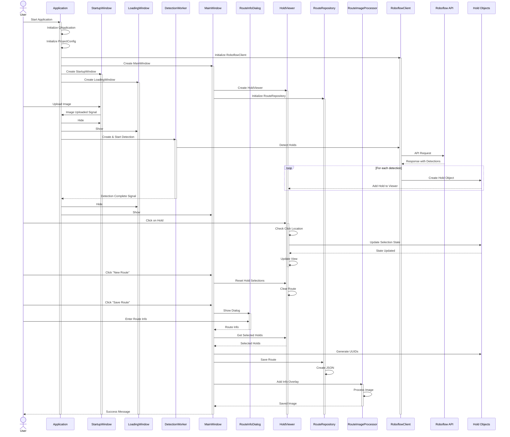

# Climbing Route Creator

## Overview
Climbing Route Creator is a mobile application that helps climbers create, share, and discover climbing routes. Using advanced computer vision technology (Roboflow API), the app automatically detects holds on climbing wall photos and allows users to create routes by selecting holds and adding descriptions. Think of it as a collaborative platform for climbers to share their favorite routes and discover new challenges.

## Key Features and project structure

```
climbing_route_creator/              # Główny katalog projektu
│
├── src/                            # Kod źródłowy aplikacji
│   ├── __init__.py
│   ├── main.py                    # Punkt startowy aplikacji
│   │
│   ├── api/                       # Moduł komunikacji z Roboflow
│   │   ├── __init__.py
│   │   ├── models.py             # Klasy reprezentujące dane z API
│   │   └── roboflow_client.py    # Klient API Roboflow
│   │
│   ├── core/                      # Logika biznesowa aplikacji
│   │   ├── __init__.py
│   │   ├── hold.py              # Reprezentacja chwytu w aplikacji
│   │   ├── connection.py        # Reprezentacja połączeń między chwytami
│   │   └── movement_type.py     # Typy ruchów (hands/feet)
│   │
│   ├── gui/                       # Interfejs użytkownika
│   │   ├── __init__.py
│   │   ├── main_window.py       # Główne okno aplikacji
│   │   ├── resources/           # Zasoby GUI (ikony, style)
│   │   │   ├── icons/
│   │   │   ├── styles/
│   │   │   └── loading.gif
│   │   ├── workers/            # Wątki robocze
│   │   │   ├── __init__.py
│   │   │   └── detection_worker.py  # Wątek do detekcji chwytów
│   │   └── widgets/             # Komponenty GUI
│   │       ├── __init__.py
│   │       ├── hold_viewer.py   # Widget do wyświetlania chwytów
│   │       ├── route_toolbar.py # Pasek narzędzi trasy
│   │       ├── route_info_dialog.py # Dialog informacji o trasie
│   │       ├── loading_window.py    # Okno ładowania
│   │       └── startup_window.py    # Okno startowe
│   │
│   ├── utils/                     # Narzędzia pomocnicze
│   │   ├── __init__.py
│   │   ├── config.py           # Konfiguracja aplikacji
│   │   ├── logger.py           # Konfiguracja logowania
│   │   └── route_image_processor.py # Przetwarzanie obrazów tras
│   │
│   └── storage/                   # Warstwa przechowywania danych
│       ├── __init__.py
│       ├── models/              # Modele danych
│       │   ├── __init__.py
│       │   └── route_model.py  # Model trasy do zapisu
│       └── repositories/        # Implementacje zapisu
│           ├── __init__.py
│           └── route_repository.py # Repozytorium tras
│
├── data/                          # Dane aplikacji
│   ├── routes/                   # Zapisane trasy (JSON)
│   ├── images/                   # Obrazy ścian
│   └── exports/                  # Wygenerowane obrazy z trasami
│
├── logs/                          # Logi aplikacji
│
├── setup.py                       # Skrypt instalacyjny
├── pyproject.toml                # Konfiguracja narzędzi
├── README.md                     # Dokumentacja projektu
└── .gitignore
```

The application allows users to:
- Automatically detect climbing holds in photos using computer vision
- Create routes by selecting holds and adding descriptions
- Add directional arrows and comments between holds
- Share routes with other climbers
- Browse and discover routes created by the climbing community

## Technical Requirements
- Python 3.8 or higher
- PyQt5 for the user interface
- Roboflow API key for hold detection
- Additional dependencies listed in requirements/base.txt

## Installation

1. Clone the repository:
```bash
git clone https://github.com/yourusername/climbing-route-creator.git
cd climbing-route-creator
```

2. Create and activate a virtual environment:
```bash
python -m venv venv
source venv/bin/activate  # On Windows use: venv\Scripts\activate
```

3. Install dependencies:
```bash
pip install poetry
poetry install
poetry update
```

4. Set up your Roboflow API key:
Create a `.env` file in the project root and add your API key:
```env
ROBOFLOW_API_KEY=your_api_key_here
```

## Getting Started

1. Run the application:
```bash
python src/main.py
```

2. To create a new route:
   - Click "New Route" and select a photo of a climbing wall
   - Wait for automatic hold detection
   - Click on holds to create your route
   - Add descriptions and difficulty rating
   - Save and share your route

## Project Structure
The project follows a modular architecture for maintainability and testability:
- `src/api/`: Roboflow API integration
- `src/core/`: Core business logic
- `src/gui/`: User interface components
- `src/storage/`: Data persistence layer
- `src/utils/`: Utility functions and configuration

## Development

For development, install additional dependencies:
```bash
pip install poetry
poetry install
poetry update
```

Run tests:
```bash
pytest
```

## Contributing
We welcome contributions! Please follow these steps:
1. Fork the repository
2. Create a new branch for your feature
3. Write tests for your changes
4. Submit a pull request

Please ensure your code follows our style guidelines and includes appropriate tests.

## License
This project is licensed under the MIT License - see the LICENSE file for details.

## Acknowledgments
- Roboflow for providing the hold detection API
- The climbing community for inspiration and feedback
- All contributors who have helped improve this project

## Contact
For questions or suggestions, please open an issue in the GitHub repository or contact the maintainers.
